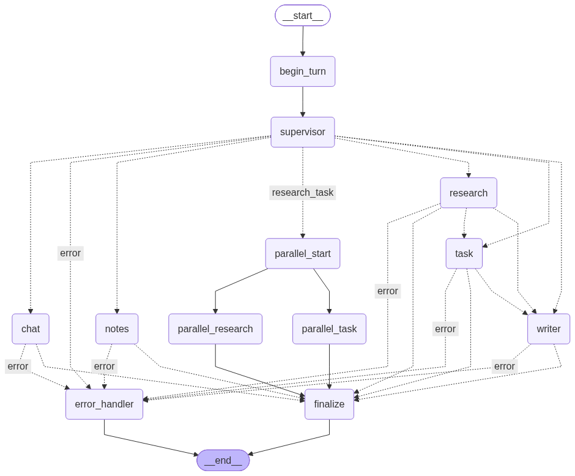

# SmartDesk

SmartDesk is a LangGraph supervisor system with specialised research, writing,
and task agents, checkpointed conversations, and persistent user data.

## Architecture



- The supervisor chooses a single agent, a sequential Research → Writer handoff,
  or parallel Research + Task execution with fan-in synthesis.
- Agent graphs and OpenRouter clients are cached and reused within the process.
- Every failure becomes state and routes to a user-facing fallback node.
- `thread_id` checkpoints conversation state in SQLite.
- `user_id` scopes persistent notes, drafts, and tasks.

## Setup

Python 3.11 or 3.12 is recommended. Python 3.14 currently produces an upstream
LangChain Pydantic compatibility warning.

```powershell
python -m venv venv
.\venv\Scripts\Activate.ps1
python -m pip install -r requirements.txt
```

Create `.env`:

```text
OPENROUTER_API_KEY=...
TAVILY_API_KEY=...
```

## Run the demo

Terminal 1 — API:

```powershell
.\venv\Scripts\python.exe -m uvicorn backend.api:app --reload
```

Terminal 2 — frontend:

```powershell
.\venv\Scripts\python.exe -m http.server 5173 --directory frontend
```

Open <http://127.0.0.1:5173>. A new username receives a backend-generated UUID
and opaque browser token. Returning from the same browser restores that user.
The API also records thread ownership, so another user cannot open the thread by
guessing its ID.

Agent model/tool stages are logged with short input and output previews so long
runs can be diagnosed without dumping complete conversations.

## Tests

```powershell
.\venv\Scripts\python.exe -m pytest -q
```

Live agent checks require the API keys:

```powershell
.\venv\Scripts\python.exe test_research.py
.\venv\Scripts\python.exe test_writer.py
.\venv\Scripts\python.exe test_task.py
```

These three root-level files are deliberately manual, paid smoke checks and are
not part of pytest collection; deterministic unit and graph-behavior tests live
under `tests/`.

## Three-turn example

```text
User: Research current LangGraph checkpointing patterns and save the findings.
SmartDesk [ResearchAgent]: [searches multiple sources and persists a tagged note]

User: Turn that research into a formal short report.
SmartDesk [ResearchAgent → WriterAgent]: [retrieves the research and persists the report]

User: Create an ordered task for reviewing and publishing it.
SmartDesk [TaskAgent]: Created task <id> with review and publish steps; status in_progress.
```

## State and persistence

1. **In-context:** `add_messages`; after 12 user turns, older history is folded
   into an incremental summary while the latest six turns remain verbatim.
2. **Thread-persistent:** `SqliteSaver` resumes the same `thread_id`, including
   after the process restarts, and isolates different threads.

Long-term semantic profile memory is intentionally disabled for now. Notes,
tasks, and drafts remain durable across threads and backend restarts through
the application SQLite store.

Transient `research_summary`, `task_output`, and `writer_output` handoff fields
are cleared at the start of every user turn. Multi-agent handoffs remain in the
checkpoint for execution, while the history API returns only the final assistant
response for each user turn.

Every graph call uses `make_thread_config`, which explicitly caps recursion at 20.

## Deployment scope

The built-in rate limiter and thread locks are process-local, so run this SQLite
demo with one API worker. A multi-worker deployment needs shared coordination
such as Redis or gateway-level rate limiting.

Page fetching rejects non-public resolved addresses and redirects. DNS rebinding
remains theoretically possible because validation and the HTTP connection resolve
the hostname separately; production deployments should also enforce an outbound
proxy or network egress policy.
